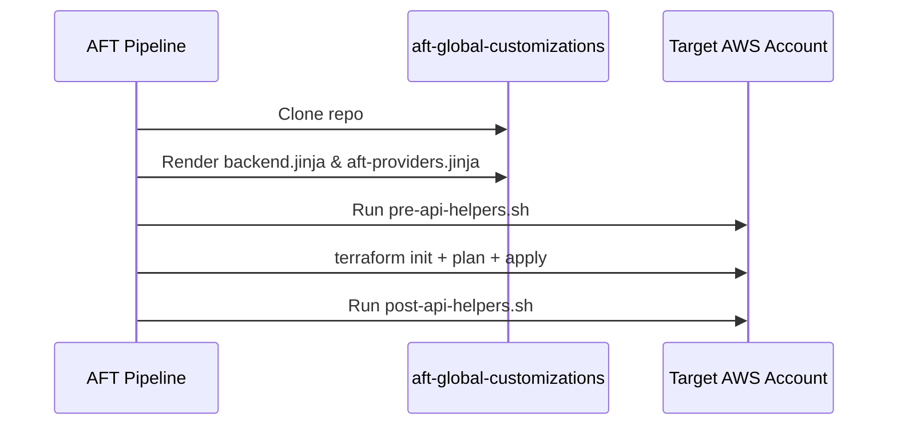
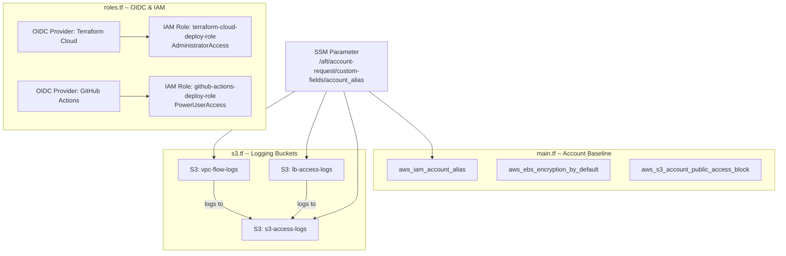

# Architecture -- aft-global-customizations

## Overview
This repository defines baseline resources that AFT (Account Factory for Terraform) applies to **every** AWS account it provisions. AFT clones this repo, renders the Jinja templates, and runs `terraform apply` against each target account.

## Execution Flow

## Resource Map

## Data Sources
| Source | Used By | Purpose |
|---|---|---|
| `aws_ssm_parameter.alias` | `main.tf`, `s3.tf` | Account alias from AFT custom fields |
| `aws_organizations_organization.current` | `s3.tf` | Org ID for S3 log delivery policies |
| `tls_certificate.provider` | `roles.tf` | TFC OIDC thumbprint |

## Private Module Dependencies
| Module | Registry | Version | Used In |
|---|---|---|---|
| `askattest/s3-bucket/aws` | `app.terraform.io` | ~> 0.4 | `s3.tf` |

## Security Controls Applied Per Account
1. **EBS encryption by default** -- all new EBS volumes are encrypted.
2. **S3 account public access block** -- prevents any S3 bucket from being made public.
3. **IAM account alias** -- set from the AFT account request custom field.
4. **OIDC-based IAM roles** -- no long-lived credentials for TFC or GHA.

## Jinja Templates (AFT-Rendered)
- `aft-providers.jinja` -- Configures the AWS provider to assume the target account admin role. Adds default tags: `Application=AFT`, `ManagedBy=AFT-Terraform`, `gitRepo=aft-global-customizations`, `Owner=Platform`.
- `backend.jinja` -- Configures S3 backend (Terraform OSS) or remote backend (Terraform Cloud) depending on `tf_distribution_type`.
